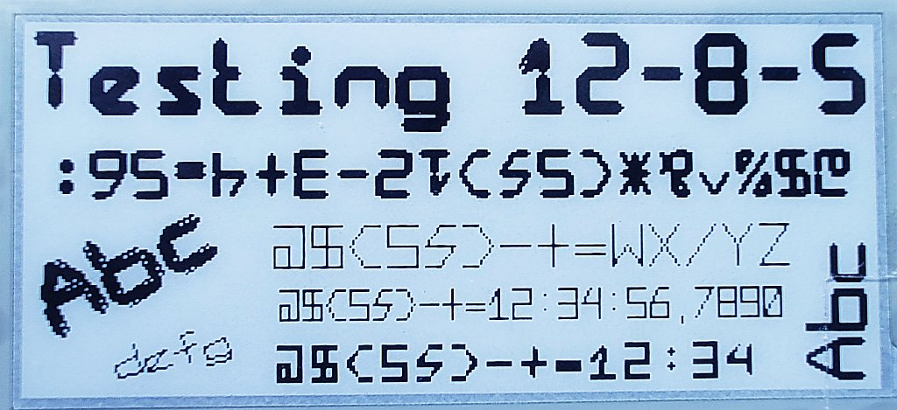
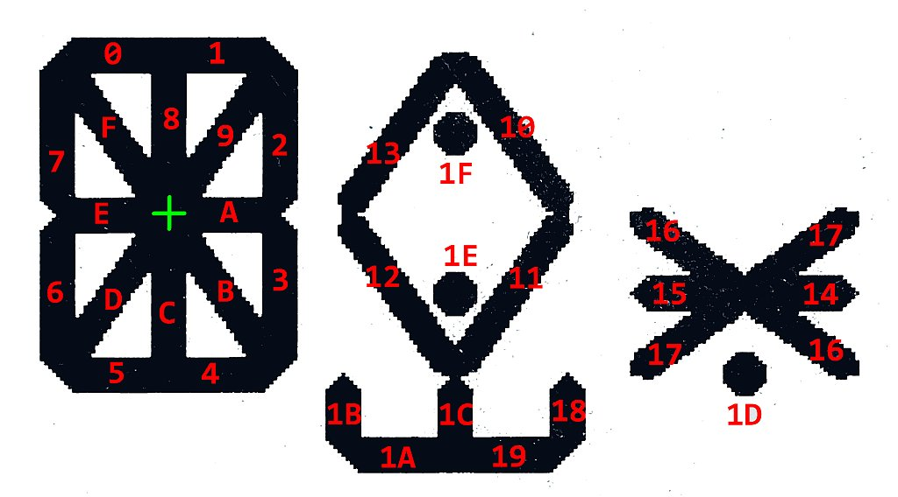

# fb_plus
FrameBuffer class extension with sizable font with any rotation



## fb_plus expands FrameBuffer by:

```
hexahonI4(x1,y1,x2,y2,bold,c)
```
drawing a flattened regular hexagon
- x1,y1 - start point
- x2,y2 - end point
- bold - width of hexagon segment
- c - color

```
circle(x0, y0, radius, c)
fill_circle(x0, y0, r, c)
```
drawing a circle or filled circle
- x0,y0 - center point
- r - radius
- c - color

```
setText32(height=None, width=None, bold=None, angle=None, gap=1)
```
setting the text font for further drawing
- height
- width
- bold - thickness of segments
- angle - angle of the text in degree
- gap - space between two characters in pixels

```
putText32(txt,x,y,c)
```
draw text
- txt - text string
- x,y - position of first characters
- c - color

## font
Each character is defined by 32 segments. The basis is a standard 16-segment display. An additional 16 segments extend the original possibilities. The last 3 segments are dots. Their diameter is larger than the "bold" font parameter. The remaining segments are formed by the hexagon i4. It is a flattened regular hexagon.

Here is map of segments:


